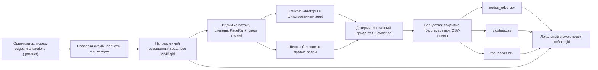

# Money Graph: схема решения

Основной расчёт локальный и детерминированный; LLM не присваивает роли. Неизвестные
переводы за границей четвёртого колена и ниже 5000 KZT не реконструируются.
Результаты — гипотезы для аналитика, а не вывод о виновности.

Запуск и формальные правила: [README.md](README.md).
